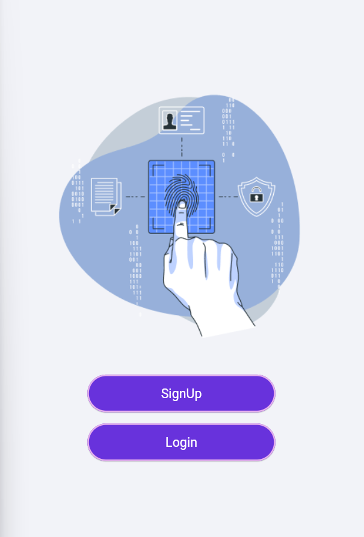
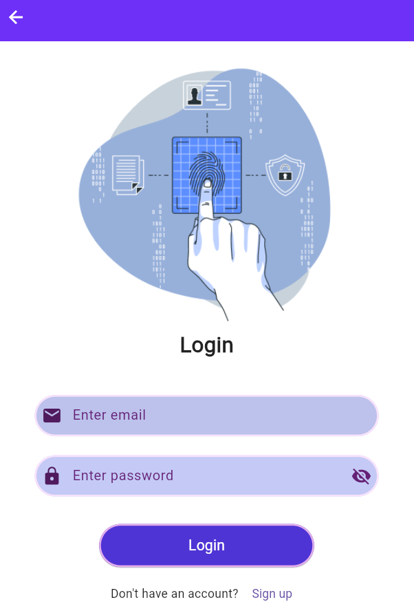
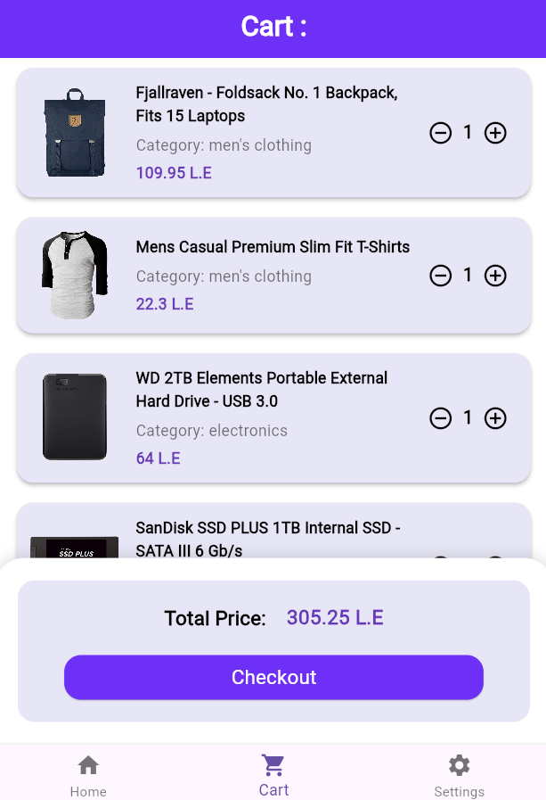
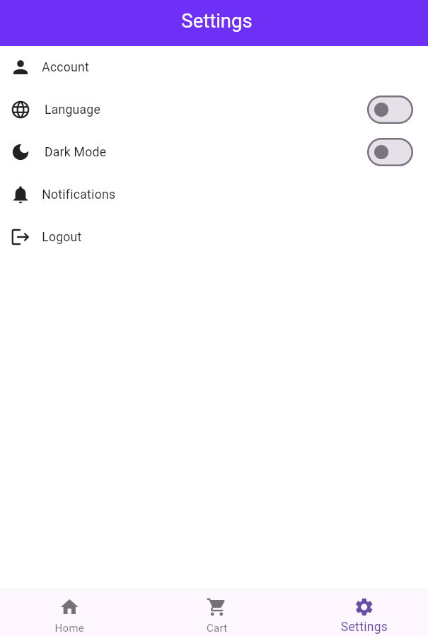
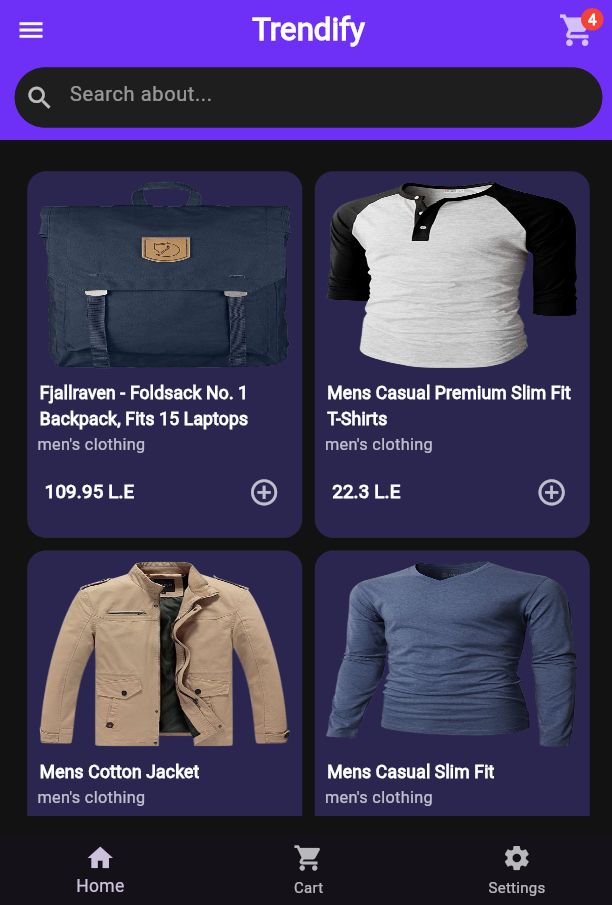

# NTI Graduation Project

**NTI Graduation Project** is a Flutter-based e-commerce application designed to manage products, display shopping carts, and provide a complete online shopping experience.

The app is fully integrated with **Firebase** for authentication and data management, and uses **Provider** for state management, including theme and language preferences. The app communicates with a backend **API** to fetch and manage product data.

---

## Features

- Product listing and detailed views
- Shopping cart management
- User authentication with Firebase
- Theme and language switching using Provider
- Integration with backend API for e-commerce functionalities
- Responsive design for multiple platforms (Android, iOS, Web, Desktop)

---
## Screenshots

<table>
  <tr>
    <td></td>
    <td></td>
    <td></td>
  </tr>
  <tr>
    <td></td>
    <td></td>
    <td></td>
  </tr>
  <tr>
    <td></td>
    <td></td>
    <td></td>
  </tr>
  <tr>
    <td></td>
    <td></td>
    <td></td>
  </tr>
</table>

---

## Installation

1. Clone the repository:
```bash
git clone https://github.com/nada50085/NTI_Graduation.git
